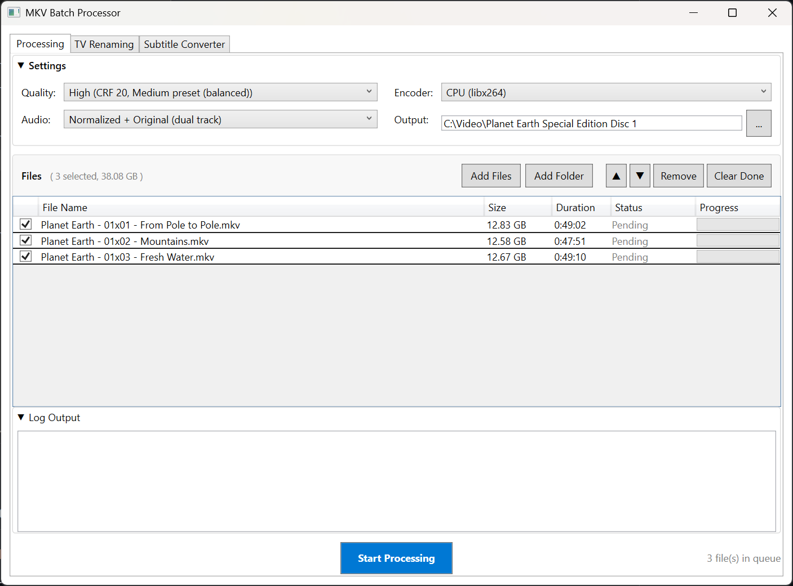
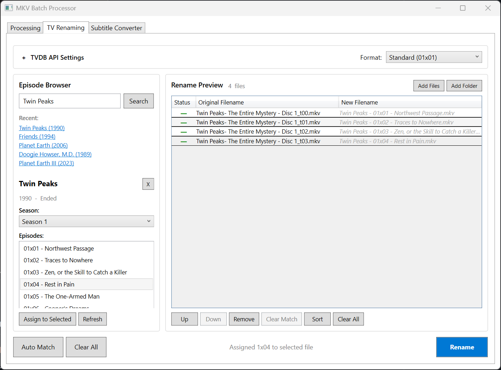
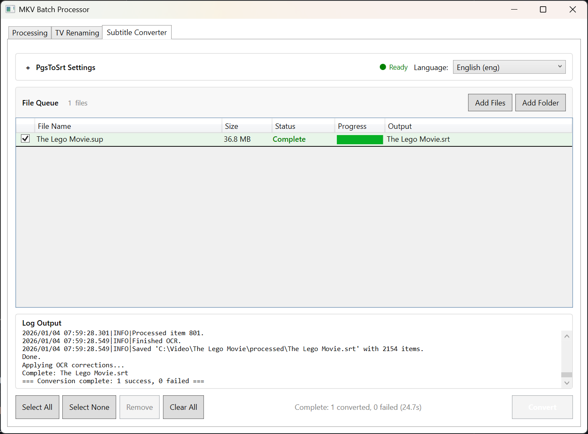

# MKV Batch Processor

A Windows desktop application (WPF/.NET 8.0) for batch converting MKV video files to MP4 format with hardware acceleration support, renaming TV show files using TVDB metadata, and converting SUP bitmap subtitles to SRT text format using OCR.

Built to solve real media management workflows - from encoding a library of video files with proper loudness normalization, to bulk-renaming TV episodes for Plex compatibility, to converting extracted bitmap subtitles into editable text.

## About This Project

This project was developed as both a practical tool and a learning exercise in **AI-assisted development**. I used AI coding assistants (primarily Claude Code) as collaborative tools throughout the development process.

**My role as the developer:**
- Defined the product vision, features, and user experience
- Made all architectural decisions (MVVM pattern, service-oriented design, technology choices)
- Provided domain expertise in video encoding, media workflows, and API integrations
- Directed implementation, reviewed all code, and drove iterative improvements
- Designed the UI/UX and determined how features should work together

**How AI assisted:**
- Accelerated implementation of boilerplate and repetitive code
- Helped explore .NET/WPF APIs and patterns
- Served as a pair-programming partner for debugging and refinement

This workflow taught me a lot about effectively directing AI tools while maintaining ownership of the codebase and design decisions. The result is a tool I actually use for my own media library management.

## Features

### Video Processing
- **Batch conversion** of MKV files to MP4 (H.264/H.265)
- **Hardware acceleration** with automatic detection:
  - NVIDIA NVENC
  - Intel QuickSync
  - AMD AMF
  - CPU fallback (libx264/libx265)
- **Two-pass audio normalization** using EBU R128 loudness standard
  - Analyzes audio loudness in first pass
  - Applies correction in second pass for consistent volume across files
- **Automatic subtitle extraction** during conversion
  - Text subtitles → SRT files
  - Bitmap subtitles (PGS) → SUP files
- **Quality presets** with CRF/bitrate settings optimized for Movies vs TV Shows
- **Real-time progress tracking** with FFmpeg output parsing
- **Pause/Resume/Cancel** controls for long-running batch jobs
- **System tray** integration with completion notifications

### TV Show Renaming
- **TVDB integration** for show search and episode metadata
- **Plex-compatible naming**: `Show Name - 01x01 - Episode Name.mkv`
- **Three-panel interface** for easy episode-to-file matching
- **Auto-match** files to episodes by detected season/episode numbers
- **Offline caching** of show data for repeated use
- **Multiple naming formats**: Standard (01x01) or Scene (S01E01)

### Subtitle Conversion
- **SUP to SRT conversion** using PgsToSrt with Tesseract OCR
- **Batch processing** with queue management
- **21 language support** for OCR accuracy
- **Pause/Resume/Cancel** during conversion
- **Drag-drop** file and folder support

## Screenshots

### Video Processing


### TV Show Renaming


### Subtitle Conversion


## Requirements

- Windows 10/11
- .NET 8.0 Runtime
- FFmpeg (bundled or system PATH)

## Installation

1. Download the latest release
2. Extract to a folder of your choice
3. Run `MkvProcessor.exe`

FFmpeg is included in the release package. Alternatively, ensure FFmpeg and FFprobe are available in your system PATH.

## Usage

### Video Processing Tab

1. Drag and drop MKV files or folders onto the application
2. Select your preferred encoder (auto-detects available hardware)
3. Choose content type (Movie/TV Show) and quality preset
4. Click **Start Processing**

### TV Renaming Tab

1. Enter your TVDB API key in the settings panel ([Get API key](https://thetvdb.com/api-information))
2. Search for your TV show
3. Select the season and add episodes to the queue
4. Add your video files (drag-drop or browse)
5. Use **Auto Match** or manually align episodes with files
6. Click **Rename** to rename files in place

### Subtitle Converter Tab

1. Configure PgsToSrt path in settings (expand settings panel)
2. Optionally set Tessdata path for language files
3. Select OCR language from dropdown
4. Add .sup files (drag-drop, browse, or add folder)
5. Click **Convert** to start batch conversion

## Architecture

The application follows the **MVVM pattern** with a service-oriented design:

```
┌─────────────────────────────────────────────────────────┐
│                    Presentation Layer                    │
│              WPF/XAML Views with Data Binding            │
└─────────────────────────────────────────────────────────┘
                            │
┌─────────────────────────────────────────────────────────┐
│                    ViewModel Layer                       │
│  MainViewModel │ TvRenamerViewModel │ SubtitleConverter  │
└─────────────────────────────────────────────────────────┘
                            │
┌─────────────────────────────────────────────────────────┐
│                     Services Layer                       │
│  FFmpegService │ TvdbService │ PgsToSrtService │ etc.   │
└─────────────────────────────────────────────────────────┘
                            │
┌─────────────────────────────────────────────────────────┐
│                      Models Layer                        │
│   MkvFile │ TvShow │ Episode │ ProcessingSettings        │
└─────────────────────────────────────────────────────────┘
```

**Key Technical Decisions:**
- **CommunityToolkit.Mvvm** for source-generated commands and properties
- **Async/await with CancellationToken** for responsive UI during long operations
- **Real-time progress parsing** from FFmpeg stdout for accurate progress bars
- **JSON-based caching** for TVDB data to minimize API calls
- **Generated regex patterns** using `[GeneratedRegex]` for episode detection

## Building from Source

```bash
# Clone the repository
git clone https://github.com/rcagle42/MkvProcessor.git

# Build
cd MkvProcessor
dotnet build

# Run
dotnet run

# Publish release
dotnet publish -c Release
```

## Configuration

Settings are stored in `%APPDATA%\MkvProcessor\settings.json`

TVDB cache is stored in `%APPDATA%\MkvProcessor\TvdbCache\`

## Attribution

### TVDB

<a href="https://thetvdb.com/">
  
</a>

Metadata provided by [TheTVDB](https://thetvdb.com/). Please consider [adding missing information](https://thetvdb.com/) or [subscribing](https://thetvdb.com/subscribe).

This application uses the TVDB API but is not endorsed or certified by TheTVDB.

### FFmpeg

This application uses [FFmpeg](https://ffmpeg.org/) for video processing, licensed under the LGPL/GPL.

### PgsToSrt

Subtitle conversion uses [PgsToSrt](https://github.com/Tentacule/PgsToSrt) with [Tesseract OCR](https://github.com/tesseract-ocr/tesseract). PgsToSrt must be downloaded separately.

## License

MIT License - See [LICENSE](LICENSE) file for details.


## Acknowledgments

- [TheTVDB](https://thetvdb.com/) for providing TV show metadata
- [FFmpeg](https://ffmpeg.org/) for video processing capabilities
- [PgsToSrt](https://github.com/Tentacule/PgsToSrt) and [Tesseract OCR](https://github.com/tesseract-ocr/tesseract) for subtitle conversion
- [CommunityToolkit.Mvvm](https://github.com/CommunityToolkit/dotnet) for MVVM infrastructure
- [Claude Code](https://claude.ai/code) - AI coding assistant used during development
